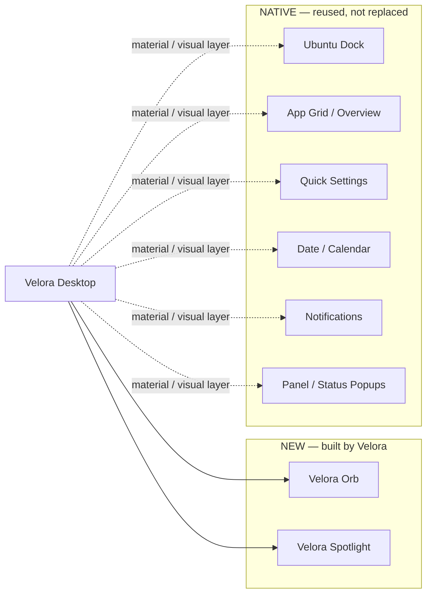
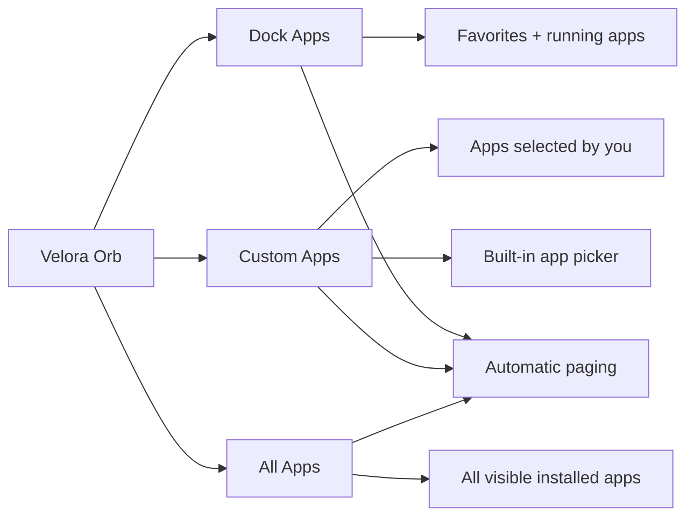
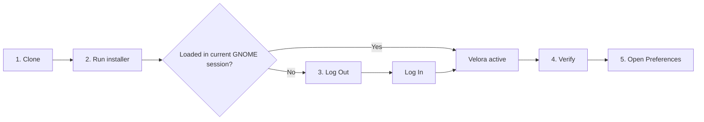

# Velora Desktop

**Velora** is my attempt to bring a real Liquid Glass material to **GNOME Shell 50** without turning Ubuntu into a different desktop.

I started building it because I wanted the desktop itself — the Dock, Quick Settings, calendar, notifications, search and other Shell surfaces — to feel more alive, translucent and refractive, but I did not want to replace the parts of GNOME that already work well.

That became the main rule of the project: **reuse the system instead of rebuilding it.**

Velora does not put a second Dock on top of Ubuntu Dock, recreate GNOME popups, or maintain duplicate controls behind the real ones. GNOME still owns the layout, input, hit targets, accessibility, animations and behaviour. Velora works underneath those surfaces and changes the supported material they are painted with.

That choice is also important for performance. Instead of continuously taking CPU screenshots or running a permanent JavaScript polling loop, Velora reuses shared wallpaper/background sources, compositor-native Clutter/Mutter actors and GPU effects. Blur can be downscaled and cached, updates are avoided when values have not changed, and expensive live scene work is only used where it is actually needed.

The goal is simple: **keep GNOME feeling native and responsive while adding refraction, blur, tint, dispersion and depth with as little extra overhead as practical.**

> Native GNOME/Ubuntu behaviour first. Velora changes the material underneath it.


<p align="center">
  
</p>

<p align="center"><sub>Velora keeps the GNOME desktop native while applying its shared Liquid Glass material across supported Shell surfaces.</sub></p>

<p align="center">
  <a href="#what-velora-adds--and-what-stays-native"><b>New vs Native</b></a>
  ·
  <a href="#velora-in-action"><b>Screenshots</b></a>
  ·
  <a href="#first-install"><b>First Install</b></a>
  ·
  <a href="#performance-principles"><b>Performance</b></a>
  ·
  <a href="#architecture"><b>Architecture</b></a>
</p>


## Highlights

- **Native GNOME Shell preserved** — Velora does not replace the desktop shell with a custom desktop UI.
- **Liquid Glass surfaces** — blur, refraction, chromatic dispersion, tint, saturation, rim/specular lighting, and optical depth.
- **Velora Orb** — draggable, multi-monitor aware launcher with **Dock Apps / Custom Apps / All Apps**, paging, and selectable **Orbit / Star / Molecule / Spiral / Petal** geometry.
- **Native Ubuntu Dock integration** — the existing Ubuntu Dock/Dash-to-Dock interaction model and icon behavior stay intact while supported material is themed.
- **Popup integration** — Date/Calendar, Quick Settings, panel/status menus, and standard GNOME PopupMenu surfaces use the shared glass system.
- **Notifications and Shell cards** — supported Shell-owned cards receive the same visual language without replacing their native content or controls.
- **Built for low overhead** — shared wallpaper sources, GPU-native actors/effects, downscaled blur, caching/reuse, event-driven updates, and no permanent JS polling loop for popup surfaces.
- **Open source** — released under the MIT License.

## What Velora adds — and what stays native

Velora deliberately mixes **new Velora features** with **native GNOME/Ubuntu surfaces that are only enhanced**.



<details open>
<summary><b>✨ New features created by Velora</b></summary>

| Feature | What Velora adds |
| --- | --- |
| **Velora Orb** | Draggable, multi-monitor radial launcher with Dock Apps, Custom Apps or All Apps sources, paging, app previews, tooltips, running indicators and idle hide/fade behaviour. |
| **Velora Spotlight** | Centered `Super+Space` application search with adaptive glass and result presentation. |

</details>

<details>
<summary><b>🧩 Native GNOME / Ubuntu surfaces enhanced by Velora</b></summary>

| Native surface | What stays native | What Velora changes |
| --- | --- | --- |
| **Ubuntu Dock / Dash-to-Dock** | Icons, hit targets, autohide/intellihide, app behaviour | Supported background/material and visual treatment |
| **GNOME App Grid / Overview** | Applications view, interaction, layout | Supported backdrop/material treatment |
| **Date / Calendar** | Calendar, notifications, controls, geometry, animations | Glass material underneath |
| **Quick Settings** | Wi-Fi, Bluetooth, audio, power and other controls | Supported Shell surface material |
| **Panel / status popups** | GNOME `PopupMenu` + `BoxPointer` geometry | Shared glass material |
| **Notifications / Shell cards** | Content, actions, animation | Shared Velora material where supported |

</details>

<details>
<summary><b>🛡️ What Velora deliberately leaves alone</b></summary>

- GTK/libadwaita application interiors
- GNOME's native input and hit targets
- GNOME accessibility ownership
- Native Shell animation/geometry where material-only integration is possible

Velora is not trying to become a replacement desktop environment.

</details>

> **Why this matters:** no second Dock pretending to be Ubuntu Dock, no duplicate Quick Settings, and no second calendar sitting behind the real one.

## Velora in action

### Native Dock + Velora Orb

<table>
  <tr>
    <td width="62%" align="center">
      
    </td>
    <td width="38%" align="center">
      
    </td>
  </tr>
  <tr>
    <td align="center"><sub>Native Ubuntu Dock, restyled with Velora's Liquid Glass material.</sub></td>
    <td align="center"><sub>Velora Orb with configurable Dock / Custom / All Apps sources.</sub></td>
  </tr>
</table>

### Orb app sources

The Orb no longer has to duplicate the Ubuntu Dock. In **Preferences → Orb → Radial Launcher → App source**, choose what the radial launcher should contain:



| Source | What appears around the Orb | Best for |
| --- | --- | --- |
| **Dock Apps** | Ubuntu favorites + currently running apps | Using the Orb as a Dock-style launcher |
| **Custom Apps** | Only the apps you select in Velora Preferences | Keeping a separate productivity/tool launcher beside the normal Dock |
| **All Apps** | Every visible installed application, alphabetically | Using the Orb as a compact full app launcher |

<details open>
<summary><b>Custom Apps</b></summary>

Select individual applications directly from Velora Preferences. The picker shows the application icon, name and desktop ID, and the Orb preserves the selected set without creating duplicate launchers.

If a selected application is later uninstalled, Velora safely skips the missing desktop ID.

</details>

<details>
<summary><b>Paging when there are more apps than fit</b></summary>

The Orb keeps its existing radial geometry instead of shrinking icons or creating unlimited rings.

When the selected source contains more applications than the current radial capacity, Velora splits them into pages and shows a small indicator such as:

```text
1 / 5 · scroll
```

Scroll over the Orb to move between pages:

```text
Scroll down / right  → next page
Scroll up / left     → previous page
```

Paging wraps from the last page back to the first and includes a short scroll throttle so touchpad gestures do not skip multiple pages accidentally.

</details>

> **Hover Orb → configured radial launcher. Click Orb → native GNOME App Grid.**  
> The source option changes only what appears around the Orb; clicking the Orb still opens GNOME's normal Applications view.

### Orb geometry

The application source and the launcher shape are independent. Choose a source, then choose how those apps are arranged:

| Geometry | Layout character |
| --- | --- |
| **Orbit** | Original circular/ring launcher; this remains the default |
| **Star** | Five-arm radial structure expanding outward from the Orb |
| **Molecule** | Inward-oriented zig-zag chain with subtle bond lines |
| **Spiral** | Apps flow outward along a progressive spiral |
| **Petal** | Flower-like multi-lobe layout around the Orb |

All geometries reuse the same app buttons, paging, tooltips, live previews and running indicators. They are generated against the active monitor bounds, and unsafe/off-screen or colliding slots are filtered before rendering.

Non-Orbit geometries use faint, non-interactive connector lines for visual structure; they do not add another launcher or change application hit targets.

### Spotlight search

<p align="center">
  
</p>

<p align="center"><sub>Super+Space opens Velora Spotlight with adaptive glass and application results.</sub></p>

### System surfaces

<table>
  <tr>
    <td width="34%" align="center">
      
    </td>
    <td width="36%" align="center">
      
    </td>
    <td width="30%" align="center">
      
    </td>
  </tr>
  <tr>
    <td align="center"><sub>Quick Settings</sub></td>
    <td align="center"><sub>Date, calendar and notification center</sub></td>
    <td align="center"><sub>Shell notification card</sub></td>
  </tr>
</table>

## Design contract

Velora follows a strict rule:

1. GNOME owns layout, geometry, content, controls, hit targets, accessibility, and animation.
2. Velora owns the supported surface material underneath that content.
3. Existing desktop behavior should remain familiar and native.

This makes Velora a **Shell material extension**, not a replacement desktop environment.

## Supported environment

- **GNOME Shell 50**
- Ubuntu / GNOME installations running GNOME Shell 50
- Extension UUID: `velora@wonderer.tech`

Velora directly targets **GNOME Shell/compositor-owned UI**. GTK/libadwaita application interiors are a separate theming domain and are not transparently restyled by a Shell extension.

## First install




> [!IMPORTANT]
> **A clean first install on GNOME Shell 50 normally needs one Log Out → Log In after the installer finishes.**  
> This is only to let the running GNOME Shell session discover and load the newly installed local extension. **You do not need Looking Glass or unsafe-mode.**  
> If the installer explicitly says Velora is already active in the current session, you can skip the logout.

### 1. Clone Velora

```bash
git clone https://github.com/Anuppaul/velora-desktop.git
cd velora-desktop
```

### 2. Install it

```bash
bash gnome-shell/install.sh
```

On a clean install, the expected final message is similar to:

```text
Velora is installed and enabled for your user.
GNOME Shell has not loaded this newly installed local extension in the current session.

Log out and log back in once to activate Velora.
```

### 3. Log out, then log back in

Use Ubuntu/GNOME's normal **Log Out** action, then sign back into the same user account.

You **do not** need to run the installer again after logging back in.

### 4. Verify that Velora is active

```bash
gnome-extensions list --active | grep velora@wonderer.tech
```

Expected output:

```text
velora@wonderer.tech
```

### 5. Open Velora preferences

```bash
gnome-extensions prefs velora@wonderer.tech
```

After this first activation, ordinary runtime updates use Velora's hot-swap path and normally **do not require another logout**.

<details>
<summary><b>Why is one Log Out → Log In needed on a clean install?</b></summary>

The extension files can be installed immediately, but the already-running GNOME Shell session may not discover a brand-new local extension safely through its normal public activation path. The installer therefore enables Velora persistently, and the next normal login lets GNOME load it cleanly.

This is a **first-discovery issue**, not a normal update requirement.

</details>

## Update

Once Velora has completed its first activation, normal updates are simple:

```bash
git pull --ff-only origin main
bash gnome-shell/install.sh
```

Runtime-only changes use the stable bootstrap/hot-swap path, so **normal updates do not require Log Out → Log In**. A session restart is only expected when GNOME itself needs to discover a new bootstrap/schema state rather than an ordinary runtime revision.

## Preferences

Open the extension preferences with:

```bash
gnome-extensions prefs velora@wonderer.tech
```

The main Velora preferences page exposes the shared system-glass profile and Orb controls. Advanced renderer controls are provided by the vendored Liquid Glass preference pages.

## Architecture

The production renderer lives under:

```text
gnome-shell/velora@wonderer.tech/vendor/liquid-glass/
```

The active integration layer is intentionally small:

```text
runtime.js
├── orbThemeRuntime.js
└── liquidGlassDock.js
    ├── popupGlass.js
    ├── notificationGlass.js
    └── vendored panel / OSD / native-dock renderer
```

### Popup surfaces

GNOME Shell 50 owns popup geometry through `BoxPointer`.

Velora's `PopupGlassManager` inserts its material inside the native popup hierarchy, below the original menu content. GNOME therefore continues to control positioning, scale, opacity, accessibility, and open/close animation.

This shared adapter covers standard GNOME `PopupMenu` surfaces, including:

- Date / Calendar
- Quick Settings
- panel and status menus
- supported context/background menus
- future standard PopupMenu instances created while Velora is active

### Refractive glass renderer

Velora does not use CPU screenshots to fake transparency.

The renderer composes compositor-native GPU actors using the shared wallpaper source and, where required, live `Meta.WindowActor` clones. The Liquid Effect pipeline provides:

- Gaussian and Dual-Kawase blur
- downscaled blur and cache/reuse
- edge displacement / refraction
- chromatic dispersion
- tint, brightness, contrast, and saturation
- rim and specular lighting
- sheen and ambient-occlusion terms
- optical sampling headroom around native card bounds

The visible GNOME card remains the original actor; Velora replaces only its supported material paint.

## Performance principles

Velora is designed to keep the visual effect practical on a live desktop:

- no permanent JavaScript polling loop for PopupMenu surfaces
- shared wallpaper source instead of CPU framebuffer readback
- GPU-native Clutter/Mutter rendering paths
- downscaled/cached blur where appropriate
- property writes avoided when values have not changed
- popup material created only when required
- native GNOME animation remains responsible for transforms

## Repository structure

```text
velora-desktop/
├── docs/
│   └── ARCHITECTURE.md
├── gnome-shell/
│   ├── install.sh
│   ├── README.md
│   └── velora@wonderer.tech/
├── README.md
└── LICENSE
```

For implementation details, see:

- [Architecture documentation](docs/ARCHITECTURE.md)
- [GNOME Shell integration notes](gnome-shell/README.md)

## Development

Useful GNOME Shell logs:

```bash
journalctl -f -o cat /usr/bin/gnome-shell | grep -i -E 'velora|liquid glass|liquidglass'
```

Expected popup adapter startup output includes:

```text
[Velora][PopupGlass] global PopupMenu adapter active
```

When a popup is converted, Velora logs an attached surface entry.

## Contributing

Contributions are welcome.

If you are changing Shell integration behavior, keep the core contract intact:

- preserve native GNOME/Ubuntu interaction and layout
- avoid replacing native controls when material-only integration is possible
- keep cleanup/disable paths safe
- avoid unnecessary polling or expensive CPU capture paths
- document architectural changes that affect surface ownership or rendering

For substantial changes, open an issue or pull request with the GNOME Shell version, reproduction steps, and relevant Shell logs.

## License

Velora is free and open-source software released under the **MIT License**.

See [LICENSE](LICENSE) for the full license text.

---

**Velora Desktop** — native GNOME behavior, refracted.
