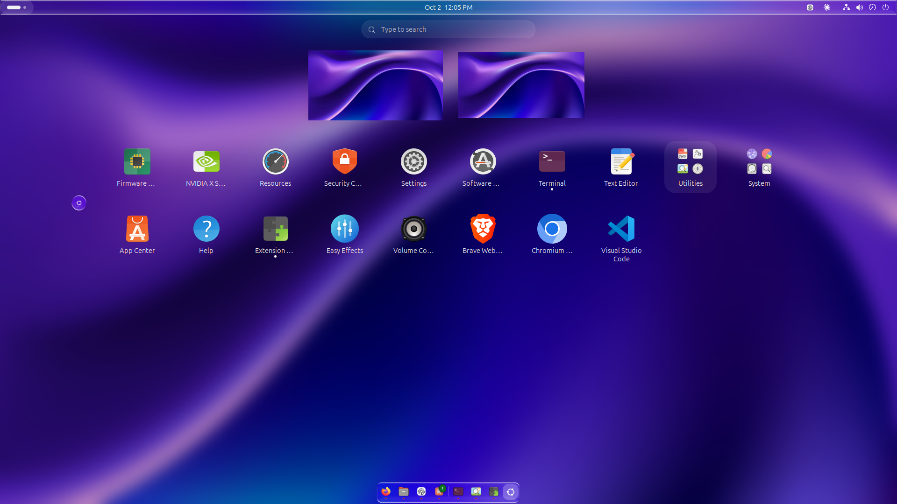
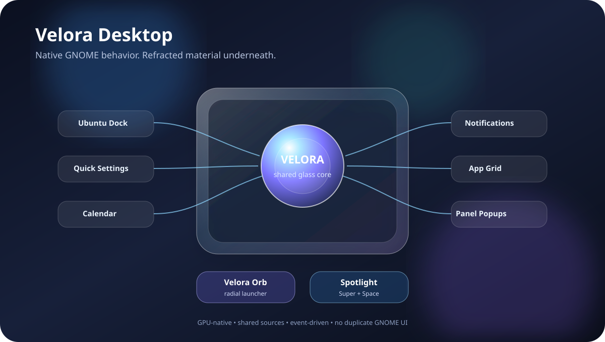
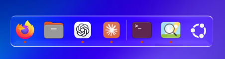
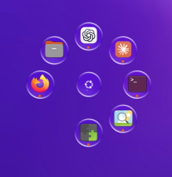
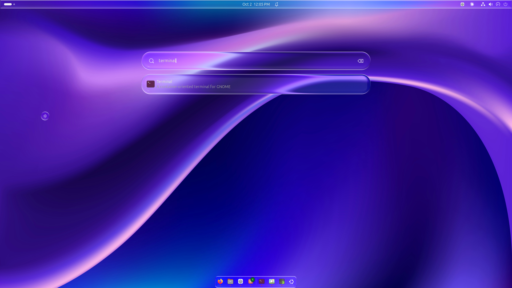
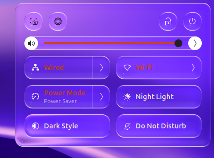
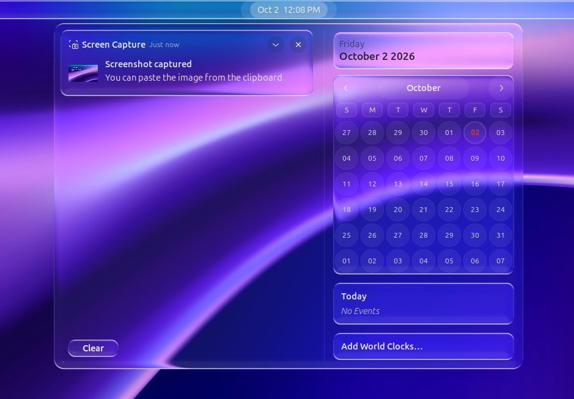
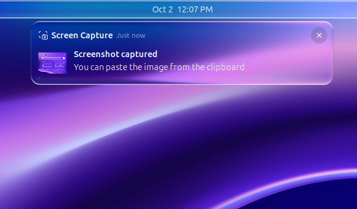
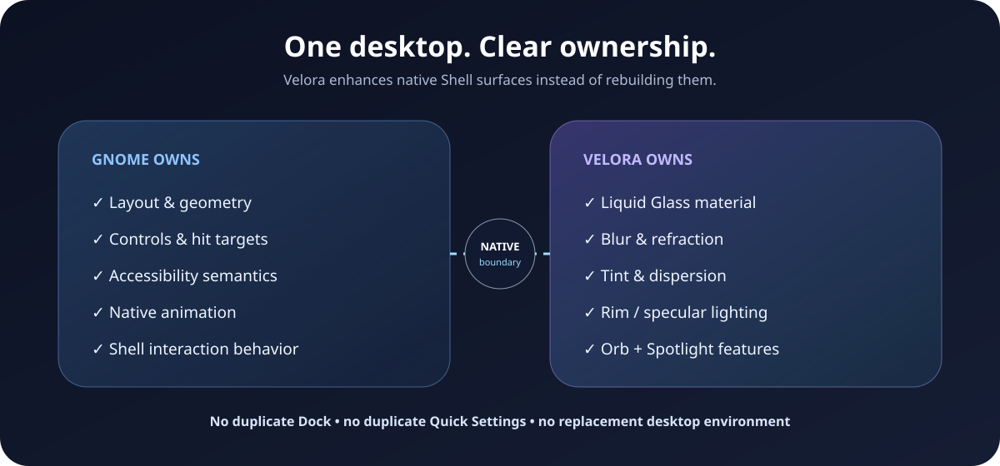
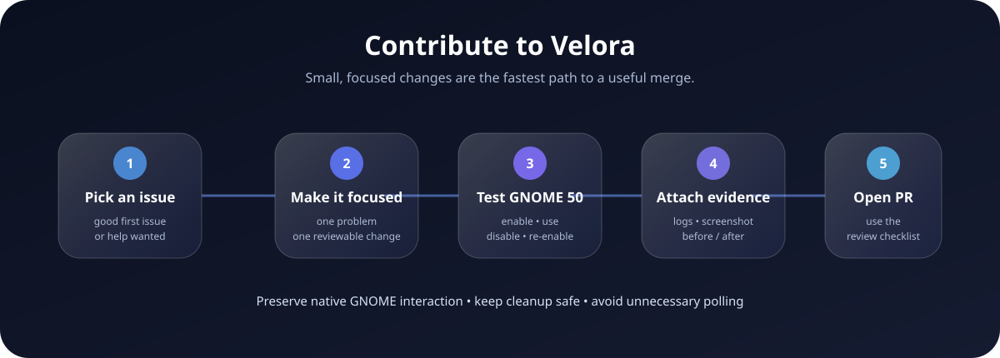

# Velora Desktop

<p align="center">
  <strong>Liquid Glass for GNOME Shell 50 — without replacing GNOME.</strong>
</p>

<p align="center">
  Velora enhances supported GNOME Shell surfaces with a shared refractive glass material, adds a radial launcher and Spotlight-style app search, and keeps native layout, controls, accessibility and interaction intact.
</p>

<p align="center">
  <a href="LICENSE"></a>
  
  <a href="https://github.com/Anuppaul/velora-desktop/actions/workflows/repository-checks.yml"></a>
  <a href="https://github.com/Anuppaul/velora-desktop/actions/workflows/codeql.yml"></a>
  <a href="https://github.com/Anuppaul/velora-desktop/issues?q=is%3Aissue%20is%3Aopen%20label%3A%22good%20first%20issue%22"></a>
</p>

<p align="center">
  
</p>

<p align="center">
  <a href="#features"><b>Features</b></a>
  ·
  <a href="#gallery"><b>Gallery</b></a>
  ·
  <a href="#install"><b>Install</b></a>
  ·
  <a href="#architecture"><b>Architecture</b></a>
  ·
  <a href="#contributing"><b>Contribute</b></a>
  ·
  <a href="#project-resources"><b>Project Docs</b></a>
</p>

> [!NOTE]
> **Project status:** active development · GNOME Shell 50 · source installation/update supported. Velora is not claiming official GNOME Extensions publication yet.

## Why Velora

Velora follows one rule:

> **Native GNOME behavior first. Change the material, not the desktop interaction model.**

It does not place a second Dock over Ubuntu Dock, recreate Quick Settings, duplicate the calendar, or replace GNOME's controls. GNOME still owns geometry, hit targets, accessibility, input and animation. Velora works beneath supported Shell surfaces and changes the material they are painted with.

<p align="center">
  
</p>

## Features

| | |
| --- | --- |
| **Liquid Glass system** | Refraction, blur, tint, chromatic dispersion, saturation, rim/specular lighting and optical depth across supported Shell surfaces. |
| **Velora Orb** | Draggable, multi-monitor radial launcher with Dock Apps, Custom Apps and All Apps sources, paging, previews, tooltips and running indicators. |
| **Velora Spotlight** | Centered `Super+Space` application search with adaptive glass and native-style result presentation. |
| **Ubuntu Dock integration** | Restyles the existing Ubuntu Dock / Dash-to-Dock surface while preserving its native icons, autohide/intellihide and interaction model. |
| **Native Shell surfaces** | Shared glass treatment for Quick Settings, Date/Calendar, notifications, panel/status popups and supported Shell-owned cards. |
| **Monitor-safe launcher geometry** | Orbit, Star, Molecule, Spiral and Petal layouts with fit-first placement and paging near monitor edges/corners. |
| **Adaptive text** | Light/dark foreground treatment where Velora owns the visual layer, without replacing semantic GNOME states. |
| **Low-overhead design** | Shared sources, compositor-native actors/effects, cached/downscaled blur and event-driven updates instead of permanent JS polling. |

## Gallery

### Native Dock + Velora Orb

<table>
  <tr>
    <td width="62%" align="center">
      
    </td>
    <td width="38%" align="center">
      
    </td>
  </tr>
  <tr>
    <td align="center"><sub>Native Ubuntu Dock with Velora material.</sub></td>
    <td align="center"><sub>Velora Orb radial launcher.</sub></td>
  </tr>
</table>

### Spotlight

<p align="center">
  
</p>

<p align="center"><sub><code>Super+Space</code> opens Velora Spotlight without replacing GNOME Overview.</sub></p>

### System surfaces

<table>
  <tr>
    <td width="34%" align="center">
      
    </td>
    <td width="36%" align="center">
      
    </td>
    <td width="30%" align="center">
      
    </td>
  </tr>
  <tr>
    <td align="center"><sub>Quick Settings</sub></td>
    <td align="center"><sub>Date / Calendar</sub></td>
    <td align="center"><sub>Notification card</sub></td>
  </tr>
</table>

## Native-first design

<p align="center">
  
</p>

| Surface | GNOME keeps | Velora changes |
| --- | --- | --- |
| Ubuntu Dock / Dash-to-Dock | icons, hit targets, autohide/intellihide, app behavior | supported background/material |
| App Grid / Overview | application view, interaction, layout | supported backdrop/material |
| Quick Settings | controls, geometry, interaction | supported Shell material |
| Date / Calendar | calendar, controls, animation | glass material underneath |
| Notifications | content, actions, animation | supported card material |
| Panel / status popups | `PopupMenu` / `BoxPointer` ownership | shared glass material |

Velora deliberately leaves GTK/libadwaita application interiors, GNOME accessibility ownership, native hit targets and native animation semantics alone.

## Velora Orb

The Orb can be used as a focused launcher or as a compact full app launcher.

| Source | Contents |
| --- | --- |
| **Dock Apps** | Ubuntu favorites + currently running apps |
| **Custom Apps** | only applications selected in Velora Preferences |
| **All Apps** | visible installed applications, alphabetically |

Scroll over the Orb to change pages when the selected source contains more apps than the current layout can display.

Available geometries:

`Orbit` · `Star` · `Molecule` · `Spiral` · `Petal`

<details>
<summary><b>Monitor-safe layout behavior</b></summary>

Velora generates the requested geometry, measures the active monitor, translates the layout inward and scales it when necessary. If the complete shape still cannot fit cleanly, Velora removes a complete outer level and moves overflow applications to the next page instead of silently dropping individual slots.

This is especially important with **All Apps** near monitor edges and corners.

</details>

## Install

### Requirements

- **GNOME Shell 50**
- Ubuntu / GNOME environment running GNOME Shell 50
- extension UUID: `velora@wonderer.tech`

### 1. Clone

```bash
git clone https://github.com/Anuppaul/velora-desktop.git
cd velora-desktop
```

### 2. Install

```bash
bash gnome-shell/install.sh
```

> [!IMPORTANT]
> A clean first install normally requires **one Log Out → Log In** so the running GNOME Shell session can discover the new local extension. If the installer reports that Velora is already active, you can skip the logout.

### 3. Verify

```bash
gnome-extensions list --active | grep velora@wonderer.tech
```

Expected:

```text
velora@wonderer.tech
```

### 4. Open Preferences

```bash
gnome-extensions prefs velora@wonderer.tech
```

## Update

```bash
cd velora-desktop
git pull --ff-only origin main
bash gnome-shell/install.sh
```

Normal runtime-only revisions use Velora's hot-swap path and normally do **not** require another logout. A session refresh is expected only when GNOME must discover changed bootstrap/schema state.

## Architecture

Velora is a **Shell material extension**, not a replacement desktop environment.

The integration model is intentionally small:

```text
runtime.js
├── orbThemeRuntime.js
├── spotlightSearch.js
├── popupGlass.js
├── notificationGlass.js
├── shellCards.js
├── appGridBackdrop.js
└── liquidGlassDock.js
    └── vendor/liquid-glass/
```

### Popup integration

GNOME Shell 50 owns popup geometry through `BoxPointer`. Velora inserts its material inside the native popup hierarchy below the original menu content, so GNOME continues to own position, scale, opacity, accessibility and open/close animation.

### Renderer

Velora does not use CPU screenshots to fake transparency. The material pipeline uses compositor-native GPU actors/effects with shared wallpaper sources and live compositor clones only where required.

The renderer supports:

- Gaussian and Dual-Kawase blur
- downscaled blur and cache/reuse
- edge displacement / refraction
- chromatic dispersion
- tint, brightness, contrast and saturation
- rim/specular lighting
- optical sampling beyond native card bounds

For the full implementation model, see [docs/ARCHITECTURE.md](docs/ARCHITECTURE.md).

## Performance principles

Velora's runtime is designed around a few constraints:

- no permanent JavaScript polling loop for PopupMenu surfaces
- no CPU framebuffer screenshot loop
- shared wallpaper/background sources
- compositor-native Clutter/Mutter rendering paths
- cached/downscaled blur where appropriate
- property writes avoided when values have not changed
- expensive material created only where required
- native GNOME animation remains responsible for transforms

Performance-sensitive changes should include reproducible before/after evidence where practical.

## Development

Useful GNOME Shell logs:

```bash
journalctl -f -o cat /usr/bin/gnome-shell | grep -i -E 'velora|liquid glass|liquidglass'
```

Contributor setup, smoke testing and component ownership are documented in:

- [Development Guide](docs/DEVELOPMENT.md)
- [Contributor Map](docs/CONTRIBUTOR_MAP.md)
- [Architecture](docs/ARCHITECTURE.md)

## Contributing

<p align="center">
  
</p>

Contributions are welcome across code, testing, accessibility, compatibility, documentation and performance work.

**Start here:**

- [Community Hub](COMMUNITY.md)
- [Contributor Guide](CONTRIBUTING.md)
- [Good First Issues](https://github.com/Anuppaul/velora-desktop/issues?q=is%3Aissue%20is%3Aopen%20label%3A%22good%20first%20issue%22)
- [Help Wanted](https://github.com/Anuppaul/velora-desktop/issues?q=is%3Aissue%20is%3Aopen%20label%3A%22help%20wanted%22)
- [Discussions](https://github.com/Anuppaul/velora-desktop/discussions)

If you are changing Shell integration behavior, preserve the core contract:

- keep native GNOME/Ubuntu interaction and layout
- avoid duplicate native controls when material-only integration is possible
- keep enable/disable cleanup safe
- avoid unnecessary polling or CPU capture paths
- document architecture changes
- preserve third-party licensing and provenance

## Project resources

| Area | Resources |
| --- | --- |
| **Community** | [Community Hub](COMMUNITY.md) · [Contributing](CONTRIBUTING.md) · [Contributors](CONTRIBUTORS.md) |
| **Development** | [Docs Index](docs/README.md) · [Development Guide](docs/DEVELOPMENT.md) · [Contributor Map](docs/CONTRIBUTOR_MAP.md) |
| **Direction** | [Roadmap](ROADMAP.md) · [Changelog](CHANGELOG.md) |
| **Maintenance** | [Governance](GOVERNANCE.md) · [Support](SUPPORT.md) · [Release Process](docs/RELEASE_PROCESS.md) · [Triage](docs/TRIAGE.md) |
| **Policies** | [Security](SECURITY.md) · [Code of Conduct](CODE_OF_CONDUCT.md) · [Third-Party Notices](THIRD_PARTY_NOTICES.md) |

## Security

Please do **not** publish exploit details for an unpatched vulnerability in a public issue.

See [SECURITY.md](SECURITY.md) for the responsible-disclosure process.

## License

Velora Desktop is released under the **MIT License**. See [LICENSE](LICENSE).

Velora also vendors/adapts third-party material whose copyright, license and provenance remain preserved. See [THIRD_PARTY_NOTICES.md](THIRD_PARTY_NOTICES.md).

---

<p align="center">
  <strong>Velora Desktop</strong><br>
  <sub>Native GNOME behavior, refracted.</sub>
</p>
